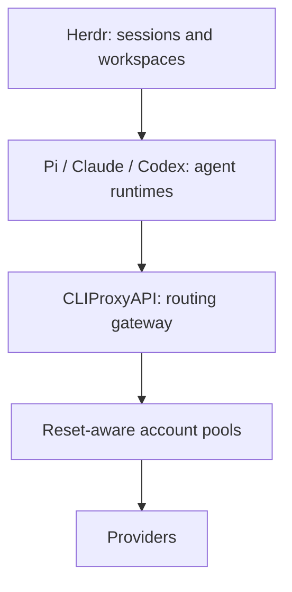
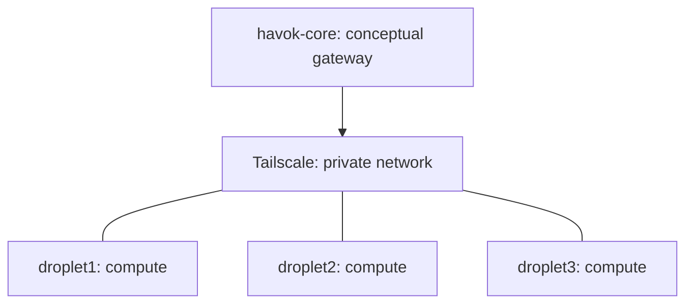

# Havok fleet operator guide

This fork preserves the operational layer around the existing reset-aware gateway. It does not relocate or change routing code. These are reusable source templates derived from the working local installation; new installations still need their own credential provisioning and validation. No live fleet is changed by the repository's offline checks.

## Architecture





Those machine labels describe the credential architecture, not hardcoded SSH targets. Configure actual aliases and hostnames in a local fleet file. Tailscale supplies authenticated private connectivity and MagicDNS. CLIProxy stays bound to `127.0.0.1` on the gateway, typically port 8317. Tailscale Serve provides the tailnet HTTPS entry point to that localhost listener. This avoids opening a provider gateway on a public droplet interface.

Do not enable Funnel: it exposes a service to the public internet. The peer bootstrap never configures Serve or public ingress. On the gateway, after checking tailnet ACLs/grants and local binding, an operator can explicitly configure private forwarding with `tailscale serve --bg http://127.0.0.1:8317` and inspect `tailscale serve status`. This command is documentation, not an automatic deployment step. Restrict tailnet access to intended machines/users. Keep remote management disabled; the management UI and diagnostics are checked locally. Recheck Serve's private access scope after upgrades.

Routing decisions happen in the existing `sdk/cliproxy/auth/reset_aware_selector.go`, `quota_refresh.go`, `sdk/cliproxy/service_reset_aware.go`, and management diagnostic handler. Agent launchers select the gateway; they do not choose provider credentials, grant resets, or alter routing strategy.

## Credential model

The conceptual gateway (`havok-core`), droplet1, droplet2, droplet3, and every future machine each receive a distinct CLIProxy client key. A label such as `compute-1-client` identifies a credential for inventory/revocation; it is never its value. Provider OAuth/auth JSON stays on the gateway, outside this repository. Herdr stores session configuration and launcher commands, never provider credentials.

Gateway operators add unique client keys to their private CLIProxy configuration using the gateway's supported configuration/control process. This tooling neither generates nor transfers keys. On Linux, an operator must manually provision `~/.config/cliproxy/client.key`, owned by the SSH user, with directory mode 700 and file mode 600. Use a trusted interactive terminal and hidden input; avoid command-line key literals, shell history, screen recording, or redirected output. For example, run this **on the destination**:

```bash
install -d -m 700 ~/.config/cliproxy
umask 077
read -r -s -p 'Unique machine client key: ' machine_credential
printf '\n'
printf '%s\n' "$machine_credential" > ~/.config/cliproxy/client.key
unset machine_credential
chmod 600 ~/.config/cliproxy/client.key
```

Use this only for a new machine or an explicitly approved rotation; the bootstrap never overwrites a key. Linked paths, wrong ownership, unsafe permissions, empty/malformed keys fail closed. Provision Windows key files using restrictive user-only ACLs in private local storage. The optional Windows `-CredentialsJson` compatibility mode reads the existing `client_api_key` field locally; neither the JSON nor the value belongs in source control. Launchers restore inherited environment values when they return, and never place client keys in process arguments. The runtime still receives its credential in its process environment, so only trusted processes should run under that user.

To remove a machine, first remove/revoke its unique key in the gateway's private client-key configuration and verify it receives 401. Remove its Tailscale device/access grants and SSH access as appropriate. Remove its local fleet entry and dispose of its local key securely. Stop its work only as a separate explicit operator action. Revoking a machine key does not require changing other machine keys or provider OAuth.

## Add a machine

1. Configure an OpenSSH alias with verified host keys and working batch authentication. The scripts accept alias names, not arbitrary shell fragments, SSH options, or `user@host` expressions.
2. Install Python 3.11+ and desired runtimes on that Linux machine separately. The scripts discover `pi`, `claude`, `codex`, and `herdr` on PATH, including `~/.local/node/bin` and `~/.local/bin`. Unsupported peer operating systems are reported without installation. Windows gateway administration uses PowerShell 7.4+.
3. Preview Tailscale onboarding with `bootstrap-tailscale-peer.ps1 -SshTarget compute-1 -Hostname compute-1 -DryRun`. Remove `-DryRun` only when deliberately onboarding. A missing Linux installation uses the official HTTPS installer and noninteractive sudo; an existing installation is kept. Running peers receive the requested hostname without a rejoin. Authentication-required output is only the manual authorization URL; treat it as sensitive transient login material and do not log it. Complete browser login and rerun to verify online state, MagicDNS, and Tailscale IPs.
4. Provision the unique machine key manually on the destination as described above. The bootstrap refuses missing/insecure keys and does not bring a key from the gateway or controller.
5. Preview agent setup: `bootstrap-remote-cliproxy-agent.ps1 -SshTarget compute-1 -Endpoint https://gateway.example.ts.net -Model gpt-6-sol -DryRun`. The endpoint is an origin without `/v1`, user info, query, or fragment. Remote endpoints require HTTPS. Remove `-DryRun` to deliberately configure that machine. Tailscale must be online and authenticated `/v1/models` must return valid JSON before any launcher/config writes.
6. Add `-EnableHerdrBindings` only if desired. Existing binding conflicts stop configuration; existing panes are never restarted or changed. Otherwise Herdr config remains untouched.
7. Copy `fleet.example.json` to `.local/fleet.local.json`, replace its synthetic labels/alias/endpoint, and run validation. Configuration contains nonsecret operational metadata only; keep actual machine information local.

Remote installation merges only Pi's `cliproxy` provider and preserves direct providers, existing models, and model metadata. It installs `pi-proxy`/`claude-proxy` when those runtimes exist and `codex-proxy` plus an isolated profile only if Codex exists. A shared helper is installed beside them. It writes nonsecret endpoint/model settings into `~/.config/cliproxy/launcher.env`. Existing key permissions must already be correct; credentials are never repaired or rotated automatically. Reruns skip unchanged files. Configurations are parsed before writes; caught file-write failures restore completed writes. Abrupt host failure can leave partial state: inspect and rerun after recovery.

## Runtime launchers

Use the opt-in commands; ordinary `pi`, `claude`, and `codex` commands retain their direct-provider configuration.

* **Claude:** `ANTHROPIC_BASE_URL` is the gateway origin, without `/v1`. `ANTHROPIC_AUTH_TOKEN` is read from the protected machine key. A conflicting `ANTHROPIC_API_KEY` is unset for the proxy child. Windows supports an optional `-PromptFile` for the existing `--append-system-prompt-file` behavior. Windows leaves Claude's default model intact unless `-Model` is passed; POSIX uses the configured model, optionally overridden by `CLIPROXY_CLAUDE_MODEL`.
* **Codex:** a `cliproxy` custom provider uses `base_url = "<origin>/v1"`, `env_key = "CLIPROXY_API_KEY"`, `wire_api = "responses"`, and `requires_openai_auth = false`. The isolated home is `~/.codex-cliproxy`. The current Windows Codex named-profile mechanism layers `cliproxy.config.toml` over `config.toml`; both are generated, with standard `[profiles.cliproxy]` compatibility also included. Windows launches `--no-daemon --profile cliproxy`, matching the verified host wrapper. POSIX uses `--profile cliproxy`; endpoint override is passed as a nonsecret provider setting. Do not reuse the isolated directory for unrelated configuration; these files are managed.
* **Pi:** its real `~/.pi/agent/models.json` custom provider uses `baseUrl = "<origin>/v1"`, `api = "openai-responses"`, and a model list. The existing installation used a leading `!command` key reader. The reusable provider uses Pi's documented `${CLIPROXY_API_KEY}` interpolation instead: the launcher exports the protected key and selects `--model cliproxy/<model>`. Both launcher variants merge only that provider so endpoint overrides take effect, preserving other providers/models and avoiding literal keys or machine-specific command paths in JSON. This merge is skipped in dry runs.

Windows entry points are `scripts/launchers/windows/{pi,claude,codex}-cliproxy.ps1`. They accept `-Endpoint`, `-KeyFile` (or `-CredentialsJson`), `-Model`, `-Executable`, and `-DryRun`. Config files are written only when running an opt-in client; Codex/Pi destinations are configurable with `-ProfileHome`/`-PiConfigPath`. These scripts require their repository-relative common helper. Use `-Executable` for a Pi installation outside PATH.

POSIX templates live in `scripts/launchers/posix/` and are installed under the opt-in `*-proxy` names. `CLIPROXY_BASE_URL` is an origin, despite the variable name. `CLIPROXY_MODEL` and `CLIPROXY_KEY_FILE` override settings; runtime overrides are `PI_BIN`, `CLAUDE_BIN`, and `CODEX_BIN`. `CLIPROXY_DRY_RUN=1` performs validation without reading the key or writing configuration. The protected helper parses `launcher.env` as data, never executes it. Use the bootstrap to register an isolated Codex profile before launching POSIX Codex.

## Herdr

Herdr is the orchestration/session/workspace layer; Pi, Claude, and Codex remain the agent runtimes, CLIProxy remains the provider/account gateway, and Tailscale remains the private network. Optional bindings add `prefix+alt+p`, `prefix+alt+c`, and `prefix+alt+x` commands for available Pi/Claude/Codex runtimes. They spawn proxy-backed panes through the verified `[[keys.command]]`, `type = "pane"` configuration mechanism. They do not replace canonical launch commands, switch running agents, attach to a focused session, or store provider keys. Put `~/.local/bin` on the shell PATH used by Herdr. Configuration edits apply according to the installed Herdr version's reload/start behavior; the bootstrap performs no reload/restart.

Agent counts are observed only if the probe runs inside an actual `HERDR_ENV=1` session. SSH probes normally report `agent_count: null` rather than infer counts or control an active UI. `herdr_available` reports executable availability, not session health. Missing Codex is an explicit supported state, not an instruction to install it.

## Validate and inventory

```powershell
./ops/havok-fleet/verify-fleet.ps1 -FleetPath .local/fleet.local.json -LocalKeyFile /path/to/protected/client.key -ManagementKeyFile /path/to/protected/management.key
./ops/havok-fleet/write-fleet-inventory.ps1 -FleetPath .local/fleet.local.json -LocalKeyFile /path/to/protected/client.key
```

Verification observes the local Windows process/listener, `/v1/models`, `/management.html`, and read-only `/v8/management/routing/reset-aware` diagnostics. Management checks require a separate local management-key file; otherwise they report `not_checked_missing_management_key`. The checker never issues a quota-refresh/reset operation or outputs rankings/account identities. Diagnostic success reports only HTTP status and whether reset-aware routing is enabled. An HTTP response alone does not establish full runtime qualification.

Each SSH machine is checked for online Tailscale, authenticated models using its own protected key, model count, runtime/launcher availability, and Herdr executable availability. No inference is issued by default. `-SmokeTest` explicitly adds **one** nonstreaming Responses request per healthy remote with `max_output_tokens: 16`, a short prompt, a 20-second operational-check timeout, and a maximum 2 MiB response read; it can consume provider quota. Output records completion status only, never inference bodies. Choose a supported `-Model`. This flag tests the gateway API, not an interactive E2E launch of each client.

Inventory v1 includes timestamp, local checks, and per-machine label, SSH alias, credential identity label, OS, Tailscale state/hostname/IPs, gateway reachability/HTTP status/model count, runtime and launcher booleans, Herdr availability, agent count (nullable), and `e2e_state`. Unknown/failure states are explicit. E2E status is fresh `not_tested`, `verified`, or `failed`; previous inventory claims are never carried forward. The synthetic example and JSON schema document the contract. Actual output defaults to `.local/fleet-inventory.json` and is ignored. Although it contains no credentials, its machine/network metadata should remain private.

`gateway.ps1` preserves the useful local start/status/stop behavior with explicit executable/config inputs and a local PID/start-time ownership record. It refuses to stop a process based only on a port or name, refuses to start when the port is occupied, requires an explicit loopback bind in configuration, and never implicitly restarts a running gateway. It is a Windows convenience command, not a deployment or supervisor replacement.

## Source inventory and exclusions

The preservation task inventoried `%LOCALAPPDATA%/CLIProxyAPI/`, its `.local/` child, this repository's `.local/`, and the operational artifacts directory associated with the build workspace. Installed remote launcher/provider metadata was inspected read-only where reachable. Reusable functionality was reworked rather than blindly copying live configuration.

| Local source material | Classification | Repository treatment |
| --- | --- | --- |
| `bootstrap-tailscale-peer.ps1` | A: reusable code with B: machine defaults | Parameterized peer bootstrap |
| `bootstrap-remote-cliproxy-agent.ps1` | A, with B: fixed gateway/node paths | Parameterized bootstrap and POSIX templates |
| `write-fleet-inventory.ps1` | A, with B/C: fixed output path and stale fleet claims | Fresh allowlisted generator/schema/example |
| `launch-{pi,claude,codex}-via-cliproxy.ps1`, `read-client-key.ps1` | A, with B: private storage paths | Configurable opt-in launchers and local key readers |
| `{pi,claude,codex}-proxy.cmd` | A: thin wrappers with B: absolute paths | PowerShell entry points; no hardcoded CMD wrappers needed |
| Repository `.local/{start,status,stop}.ps1` | A, with B/D: credentials path assumptions | Explicit ownership-aware gateway command and health checker |
| Installed remote `*-proxy` and Pi provider registration | A/B: templates and machine settings | Sanitized templates; runtime configs excluded |
| Live YAML, configuration backups, credential JSON, machine-key files | B/D: machine config/secrets | Never copied, staged, or printed |
| Gateway binaries, downloaded UI assets, PID/state files | C: generated runtime | Excluded |
| Current and historical fleet inventory, stdout/stderr logs, backups | B/E: private operational metadata/evidence | Preserved locally; not committed |
| Reconciliation executables, partial backup source trees, debug/temporary output | E/F: evidence/debugging | Preserved locally; not treated as reusable ops source |

Do not copy `~/.cli-proxy-api/*`, real provider auth files, Tailscale auth state, SSH private keys, management keys, `.env`, or local secret-bearing config into this repository. `.gitignore` protects common local runtime/key/inventory paths while retaining source examples. The scoped scanner checks literal credential patterns and private-key material and prints only file/line/rule identifiers. It is defense in depth, not proof that every possible secret format is detectable; manually review staged files as well. The offline CI workflow needs no machines, accounts, keys, or inference.

## Safely update this fork

1. Confirm `git status`, branch, and remote URLs. Push only to `https://github.com/Havokyn/CLIProxyAPI.git`. Preserve unrelated work and create a local backup branch/tag before reconciliation.
2. Fetch the original project as a read-only upstream remote (`https://github.com/router-for-me/CLIProxyAPI.git`). Inspect its commit log and diff before integrating. Prevent accidental pushes by setting that remote's push URL to a deliberately unusable value such as `DISABLED`.
3. Create a feature branch from current fork main. Merge/reconcile upstream changes; inspect conflicts against reset-aware routing, quota telemetry, management diagnostics, and ops tooling. Preserve local modifications rather than overwriting them. Do not use destructive reset/clean commands.
4. Run focused reset-aware tests and the offline fleet checks, then `go test ./...`, followed by `go build -o <temporary-output> ./cmd/server`. Go recursively discovers Go files in untracked backup directories too: use a clean candidate worktree if runtime backups are present under the repository. Keep those backups intact. Do not convert a failed/unfinished test into a PASS claim.
5. Review `git diff`, `git diff --check`, staged paths, and the secret scan. Commit only intended source/docs/tests; push the branch to the Havokyn fork. Merge into fork main only after acceptance checks pass.
6. Deploy as a separate, explicitly authorized operation: preserve the running binary/config, stage a new binary, record the tested commit, and retain an immediate rollback path. Avoid changing credentials during binary replacement.
7. Verify listener, models, local UI/diagnostic endpoint, and reset-aware policy/telemetry with fresh evidence on that exact deployment. Preserve old evidence; do not transfer qualification between commits. Push only to the Havokyn fork, never the original project.

This preservation task authorizes source control work, not deployment. No Tailscale reinstall, machine key regeneration, gateway restart, provider OAuth change, live Herdr edit, or routing-strategy change is part of it.

Example focused checks in a clean candidate checkout:

```powershell
go test ./sdk/cliproxy/auth ./sdk/cliproxy ./internal/api/handlers/management -run 'ResetAware|Quota'
python -m unittest discover -s tests/fleet -v
pwsh -NoProfile -File tests/fleet/test-powershell-launchers.ps1
python ops/havok-fleet/check-secret-safety.py
```
